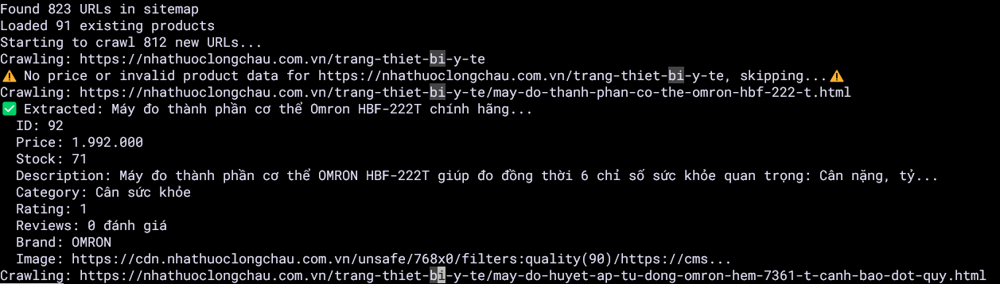
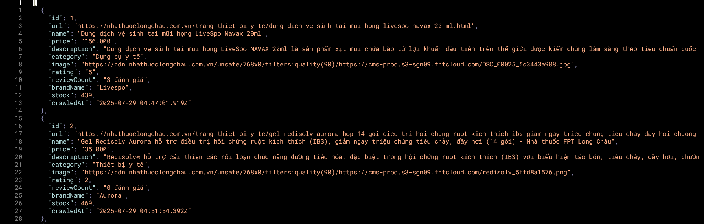

# Web Scraping

This is a basic web scraping project using node.js libraries (`puppeteer`, `puppeteer-core` and  `xml2js`) to scrape Long Chau's Pharmacy's website data for my own personal use ( Have not check the robot.txt, please don't sue me ) .

# Pre-requisites

- Run these commands to install the required libraries:

```bash
# Install the required libraries
npm init -y
npm install puppeteer puppeteer-core xml2js
```

- Clone my repository:

```bash
git clone https://github.com/quynezz/Web-Scraping.git
```

And then run the script:

```bash
node <whateverthenamecalled>.js
```

# Images taken from the website





